# code-quiz

## Description

- What was your motivation? I learn alot about Web-APIs for javascript and how used the local storage so make my website more professional and was very challenge
- Why did you build this project? I build this project to generate mutiple choice question and this can used every where college,school,driver text, etc..
1- I solved many problems like: make all the code for website in one HTML file and one Javascript file
2- run the time on the webpage when quiz start
3- move question by question until the question end
4- show the high score with the textbox to put initial name
5- used localstorge to save the scores 
- What did you learn? I learn web-APIs for javascript and how to used the time,localstorage and evenlistener.

## Installation

N/A

## Usage
when open the webpage, there is a Botton called "starting Quiz" , when click it will show the time moving and the first question with muliple choice and at the end will show the score and the submit button to save it in local storage.
picture shows the code and the website running.

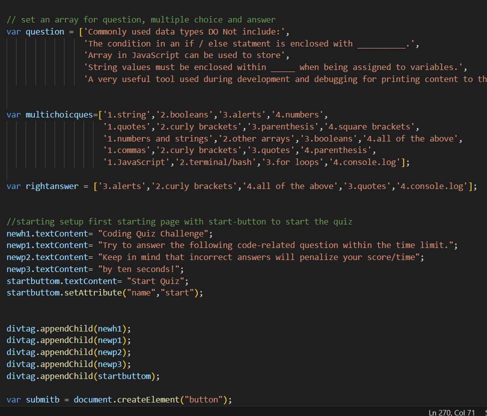
image 1: 

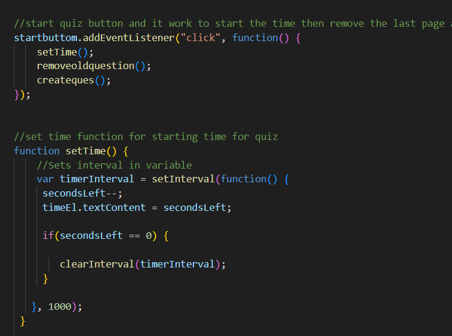
image 2: 

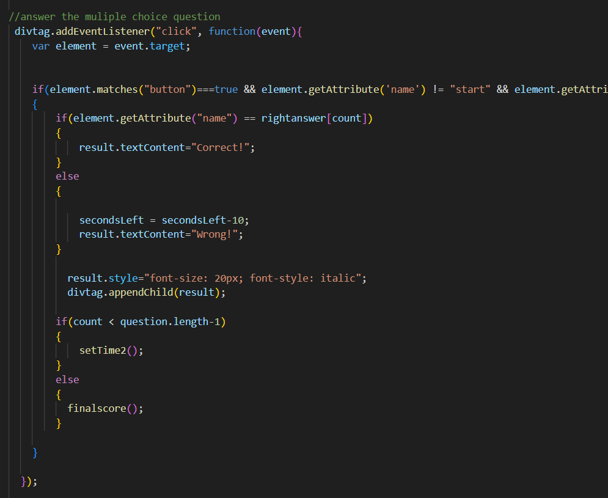
image 3:  

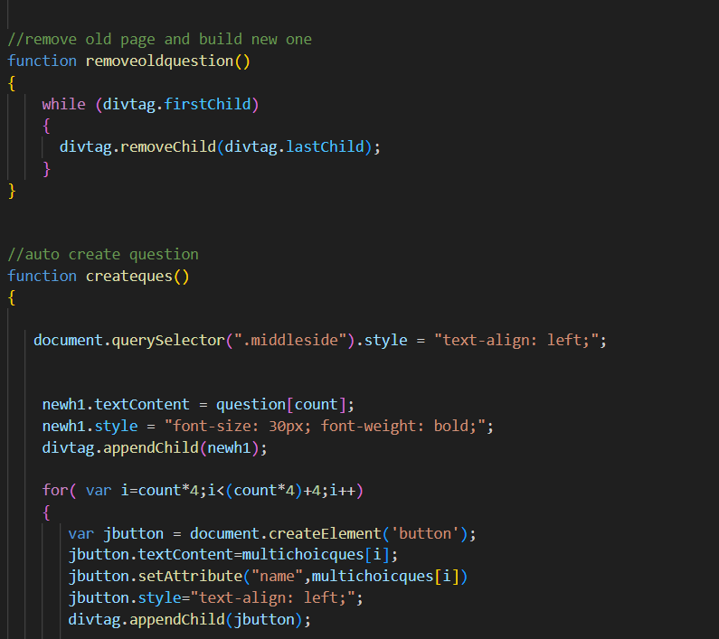
image 4: 

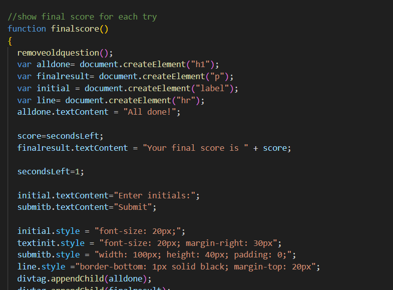
image 5: 

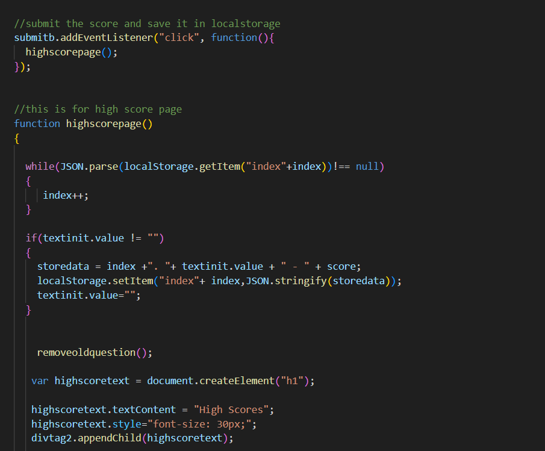
image 6: 

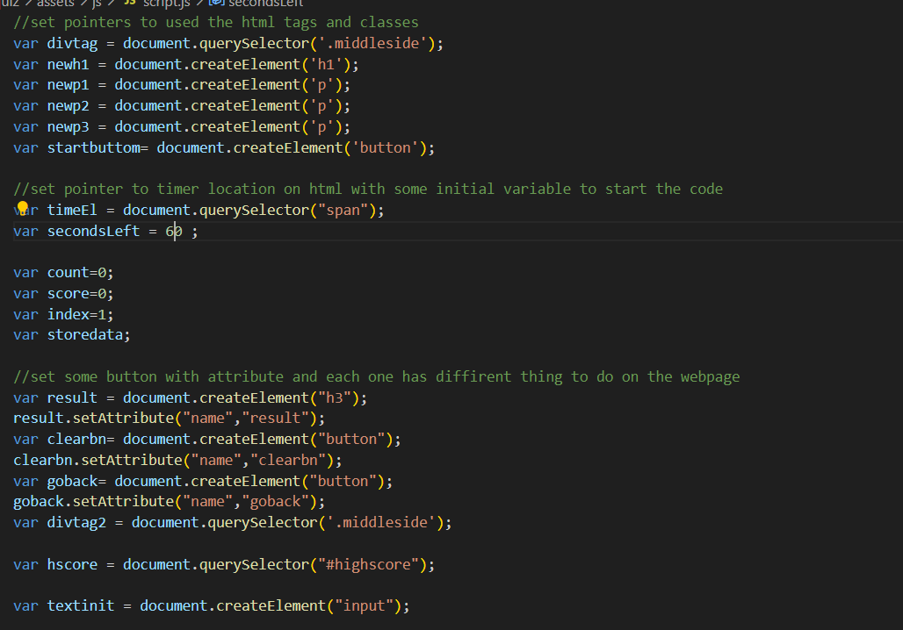
image 10: from image1 to image 10 show the code with explanation

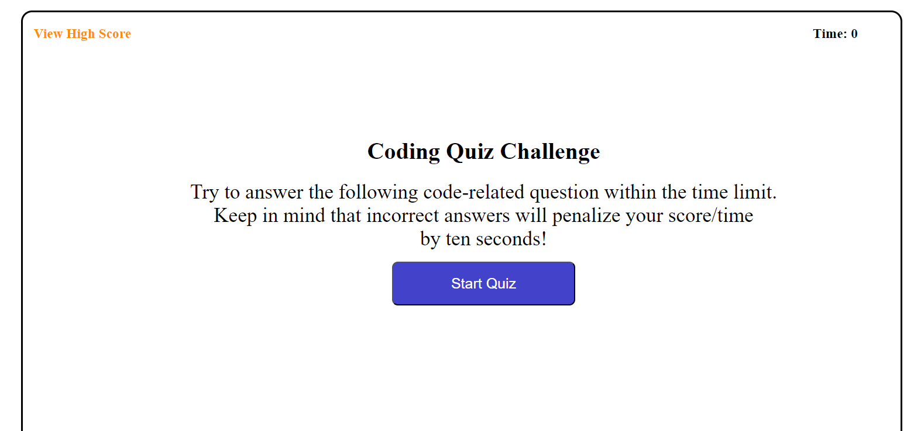
image 11: 

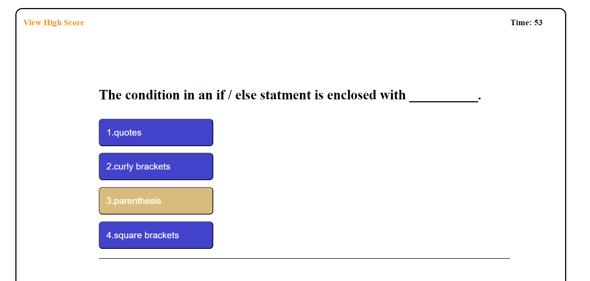
image 12: 

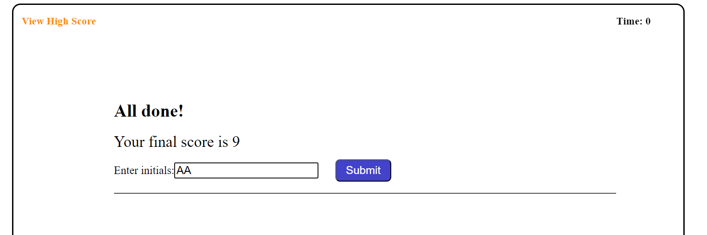
image 13: 

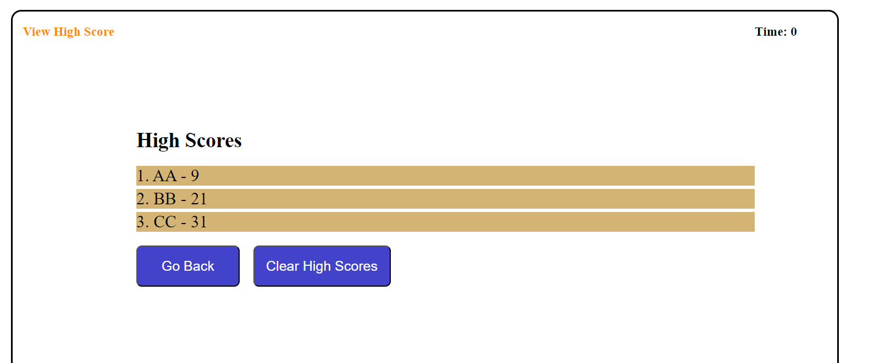
image 14: from image 11 to 14 show the webpage running

## Credits

Thank you for tips and sugestion from Bootcamp instructors and classmates, I hava used https://www.w3schools.com/ , https://stackoverflow.com/ and https://developer.mozilla.org/en-US/docs/Web/CSS/grid-template to reserch information 

## License

Please refer to the LICENSE in the repo.